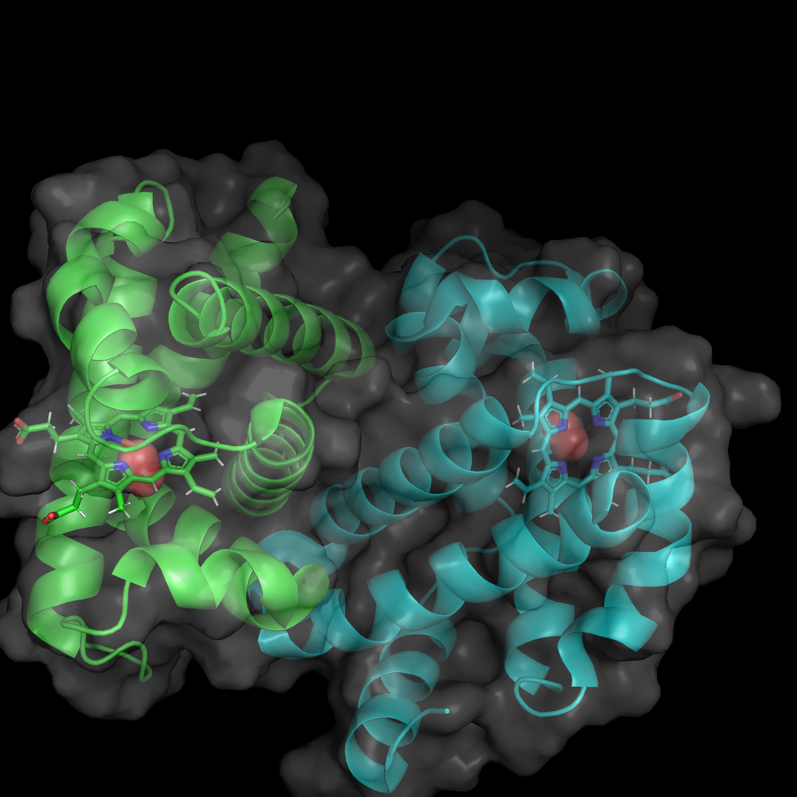

# Домашнее задание 4
По - PyMOL2

Белок - [гемоглобин](https://www.rcsb.org/structure/6bb5)

Изображения [в папке res](./res)

Способ получения - [скрипт на питоне](main.py)

Хорошее изображение (сделано не скриптом)

